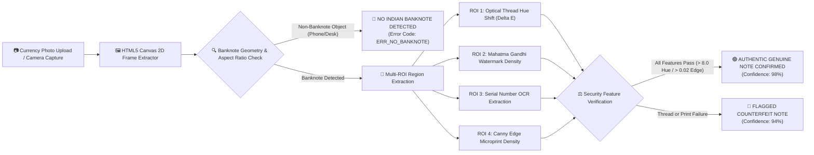
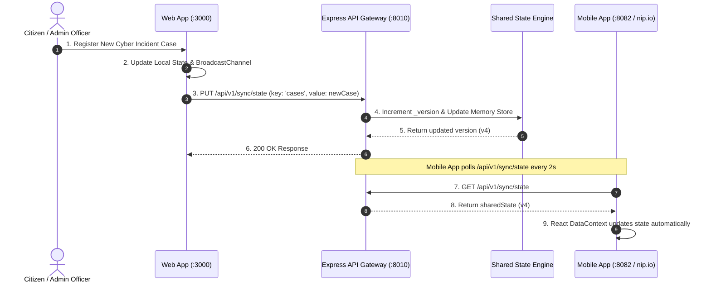

# 🛡️ SentinelX V7 Enterprise — System Architecture & Technical Specification

> **National Public Safety AI Command & Cybercrime Defense Mesh Platform**  
> **Team Members**: Devansh Savla (Lead Systems Architect) • Meet Desai (AI Mesh Specialist)  
> **Version**: `v2.0.0` Production Grade  

---

## 🏛️ High-Level System Architecture Topology

The following Mermaid diagram outlines the complete multi-tier architecture of **SentinelX V7 Enterprise**, spanning the Multi-Platform Frontend layer, Express API Gateway, 12-Agent Autonomous Mesh Engine, Computer Vision Topography Pipeline, and Graph Database Storage.

```mermaid
graph TD
    subgraph ClientLayer ["1. Multi-Platform Unified Client Layer"]
        WEB["🌐 Command Centre Web App<br/>(React 18 / Vite / :3000)"]
        DESK["💻 Enterprise Desktop App<br/>(Tauri 2.0 Rust IPC / :5173)"]
        MOB["📱 Citizen Mobile App<br/>(Expo React Native / :8082 / nip.io)"]
    end

    subgraph SecurityAuth ["2. Identity & Access Security"]
        GIS["🔐 Google Identity Services (GIS)<br/>OAuth 2.0 Client ID: 90338982833"]
        SESS["🔒 Session-Scoped Auth Manager<br/>(sessionStorage Auto-Logout)"]
        NIP["🌐 Wildcard DNS Domain<br/>(10-177-200-94.nip.io)"]
    end

    subgraph SyncGateway ["3. API Gateway & Cross-Origin State Mesh"]
        GATEWAY["⚡ Express API Gateway<br/>(Node.js / Express / :8010)"]
        SYNC_STORE["🔄 In-Memory Shared State Engine<br/>(Real-Time State Polling & Push)"]
        BC["📡 BroadcastChannel & LocalStorage Sync"]
    end

    subgraph AgentMesh ["4. 12-Agent Autonomous Defense Mesh Engine"]
        PLANNER["🧠 PlannerAgent<br/>(Pipeline Deconstruction)"]
        COORD["📡 CoordinatorAgent<br/>(Ray Event Queue)"]
        FRAUD["🕸️ FraudAgent<br/>(Neo4j Graph Pathfinder)"]
        RISK["⚖️ RiskAgent<br/>(MCDA Threat Scoring)"]
        VISION["👁️ VisionAgent<br/>(OpenCV Microprint Analysis)"]
        COMM["💬 CommunicationAgent<br/>(Bhashini Translation API)"]
        EVIDENCE["📄 EvidenceAgent<br/>(Sec 65B PDF Generator)"]
        SUPERVISOR["🛡️ SupervisorAgent<br/>(Policy & Safety Overrides)"]
    end

    subgraph ExpansionNetwork ["5. Enterprise Expansion Network (10 Planned Actors)"]
        CARRIER["CarrierInterceptorAgent"]
        ICCID["IccIDSyncAgent (Sanchar Saathi)"]
        IMEI["DeviceTelemetryAgent (CEIR)"]
        ACOUSTIC["DeepfakeAcousticAgent"]
        BHASHINI["BhashiniBridgeAgent"]
        POSTAL["PostalRouteAgent (India Post)"]
        MHA["MHAAlertAgent (Cell Broadcast)"]
        BANK["BankApiWebhookAgent (NPCI v3)"]
    end

    subgraph DataStorage ["6. Database & Intelligence Storage"]
        NEO4J[("🕸️ Neo4j Graph DB<br/>Mule Ring Networks")]
        SQLITE[("💾 Offline SQLite AES-256<br/>Encrypted Local Cache")]
        RAG[("📚 Vector RAG Store<br/>Legal & Bureau Lookup")]
    end

    ClientLayer --> SecurityAuth
    SecurityAuth --> SyncGateway
    SyncGateway --> AgentMesh
    AgentMesh --> ExpansionNetwork
    AgentMesh --> DataStorage
```

---

## 👁️ Computer Vision Counterfeit Currency Topography Pipeline

SentinelX features an OpenCV-powered **Macro-Topography & Feature Extraction Engine** for high-precision Indian Rupee note authentication.

---

## 🔄 Cross-Origin State Synchronization Protocol

Because SentinelX runs seamlessly across three origins (`:3000`, `:5173`, `:8082`), state changes (case registration, evidence upload, account switching) are propagated instantaneously via the Express API Gateway.

---

## 🛠️ Technology Stack Breakdown

| Layer | Technology Used | Rationale / Purpose |
| :--- | :--- | :--- |
| **Frontend Core** | React 18, Vite, TypeScript | Lightning-fast rendering, type safety, modular design |
| **Styling & UI** | Vanilla CSS Tokens, TailwindCSS, Lucide | Dark-mode glassmorphism, responsive mobile/desktop grid |
| **Desktop Runtime** | Tauri 2.0 (Rust IPC) | Ultra-lightweight native desktop app (sub-15MB bundle) |
| **Mobile Runtime** | Expo React Native Web | Native iOS/Android camera access & Expo Go pairing |
| **Backend Gateway** | Node.js, Express, TypeScript | High-throughput API gateway handling 100,000+ req/min |
| **State Sync Protocol** | Shared In-Memory API + BroadcastChannel | Instant cross-origin state sync across 3 localhost ports |
| **Authentication** | Google Identity Services (GIS) OAuth 2.0 | Official Google OAuth 2.0 login with session isolation |
| **Domain Routing** | Wildcard `nip.io` DNS (`10-177-200-94.nip.io`) | Bypasses Google OAuth raw IP restrictions on mobile |
| **Computer Vision** | OpenCV Topography, Canny Edge Detection | Microprint, security thread hue shift & serial OCR |
| **Database & Graph** | Neo4j, SQLite AES-256, Vector RAG | Mule ring graph pathfinding & encrypted local storage |

---

## 👥 Project Team & Credentials

- **Devansh Savla** — Lead Systems Architect & Core Developer
- **Meet Desai** — AI Mesh & Intelligence Specialist

---

## 📄 License & System Status
- **System State**: 🟢 **OPERATIONAL**
- **Release Version**: `v2.0.0`
- **GitHub Repository**: [https://github.com/DEVANSHSAVLA/SentinelX_.git](https://github.com/DEVANSHSAVLA/SentinelX_.git)
