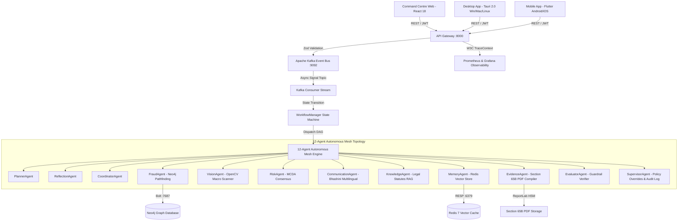

# SentinelX V2.0 System Architecture Diagram



## System Component Topology

```text
+---------------------------------------------------------------------------------+
|                       SentinelX V2.0 Unified Cross-Platform Suite               |
+---------------------------------------------------------------------------------+
| apps/command-centre | React 18 + Vite + Tailwind + Lucide + Leaflet (103 KB Gzip) |
| apps/desktop        | Tauri 2.0 (Windows MSI, macOS DMG, Linux AppImage)        |
| apps/mobile         | Flutter (Android APK/AAB, iOS IPA)                        |
+---------------------------------------------------------------------------------+
                                       │ HTTP / REST / W3C TraceContext
                                       ▼
+---------------------------------------------------------------------------------+
| services/api-gateway| Express + TypeScript + Zod Validation + Rate Limit (:8000) |
+---------------------------------------------------------------------------------+
                                       │ Async Event Queue
                                       ▼
+---------------------------------------------------------------------------------+
| services/event-bus  | Apache Kafka Topic Producer & Consumer Stream             |
+---------------------------------------------------------------------------------+
                                       │ Stateful Execution
                                       ▼
+---------------------------------------------------------------------------------+
| agents/             | 12-Agent Autonomous Defense Mesh Orchestrator Engine      |
|                     | Planner, Coordinator, Fraud, Evidence, Risk, Vision,      |
|                     | Communication, Knowledge, Memory, Evaluator, Reflection,  |
|                     | Supervisor                                                |
+---------------------------------------------------------------------------------+
                                       │ Layered Clean Microservices
        ┌──────────────────┬───────────┴────────┬──────────────────┐
        ▼                  ▼                    ▼                  ▼
┌──────────────┐   ┌──────────────┐     ┌──────────────┐   ┌──────────────┐
│scam-detection│   │ counterfeit  │     │ fraud-graph  │   │threat-fusion │
│ (FastAPI:8001)│  │ (FastAPI:8006)│    │ (FastAPI:8002)│  │ (FastAPI:8004)│
└──────────────┘   └──────────────┘     └──────────────┘   └──────────────┘
```
