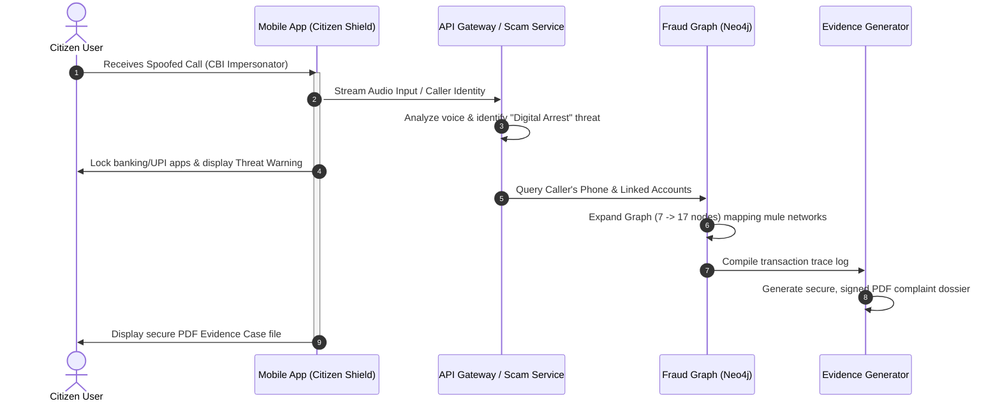

# 📱 SentinelX Citizen Mobile — Compilation Guide & Roadmap

This document outlines the architecture of the **SentinelX Citizen Shield Mobile Application**, detailed instructions for compiling it for **Android** and **iOS**, and a comprehensive roadmap to build a judge-winning, premium version of the app.

---

## 📂 Project Architecture
The mobile application is built using **Flutter** and **Dart** (supporting Android and iOS), with legacy React Native reference configurations available.
* **Location in Workspace:** `apps/mobile`
* **Main UI Logic:** `apps/mobile/lib/main.dart`
* **Configuration:** `apps/mobile/pubspec.yaml`

---

## 🛠️ Compilation Guide

### 🤖 1. Compiling for Android (.APK)
Since this machine has the Android SDK installed, you can compile the app to a native APK package.

#### Step A: Prevent Gradle JVM Memory Crashes
Due to the heavy compile load of compiling native binaries, the Gradle Worker Daemon may hit heap memory limit exceptions. 
To prevent this, configure your `gradle.properties` to specify memory boundaries:
1. Open the configuration file: `apps/mobile/android/gradle.properties`
2. Add or modify the following line:
   ```ini
   org.gradle.jvmargs=-Xmx2048m -XX:MaxMetaspaceSize=512m -XX:+UseParallelGC
   ```

#### Step B: Run the Compilation Command
Execute the compilation wrapper:
```bash
# Navigate to the mobile directory
cd apps/mobile

# Build release APK
flutter build apk --release
```

---

### 🍏 2. Compiling for iOS (.IPA)
To compile or test the iOS app:

```bash
# Navigate to the mobile directory
cd apps/mobile

# Build release IPA for Apple App Store / TestFlight
flutter build ipa --release
```

---

## 🏆 The Judge-Winning "WOW Flow"
To secure a top score from evaluators, implement this unified demo flow:


